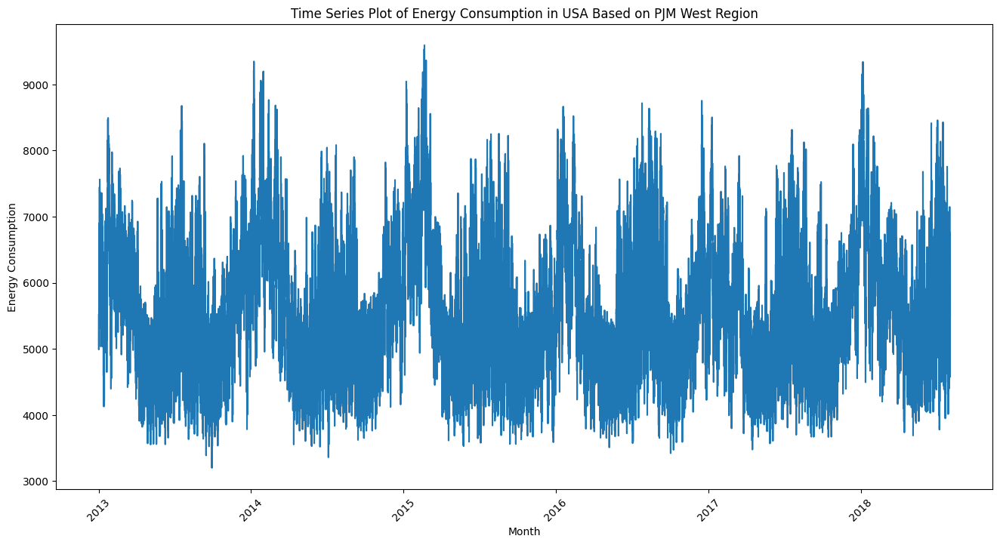
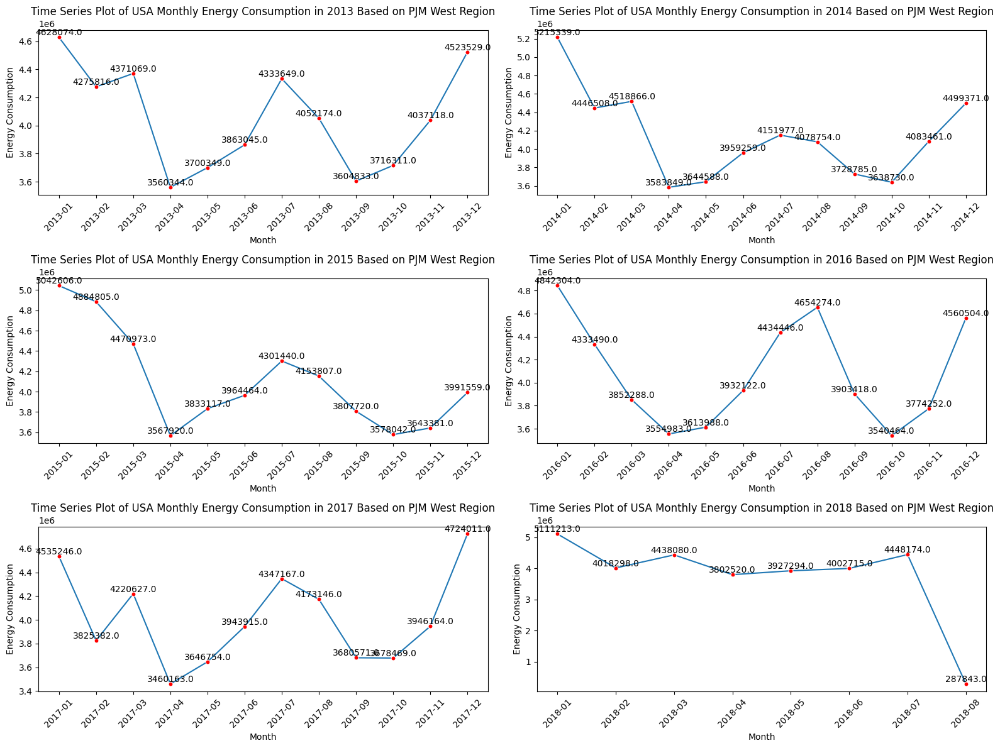
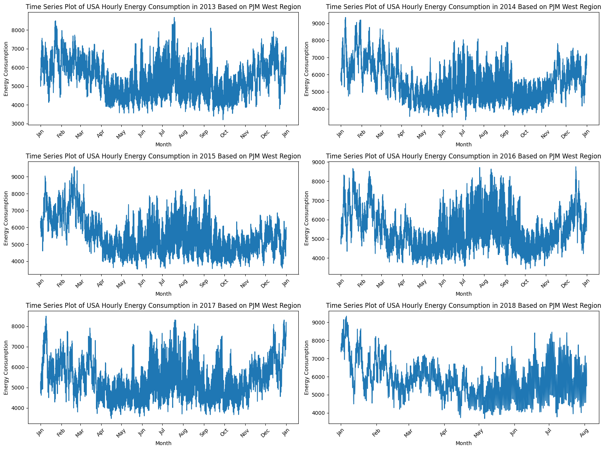

# USA Energy Consumption Forecasting
A project for my submission of my learning in IDCamp 2023 about machine learning to make a forecast. This project is about forecasting energy consumption in US especially in PJM West Region. The PJM West Region is a part of the PJM Interconnection, a regional transmission organization (RTO) that coordinates the movement of wholesale electricity in all or parts of 13 states and the District of Columbia. The PJM West Region specifically refers to the areas that were added to PJM in 2014, following the merger of PJM with FirstEnergy Corp.'s Mid-Atlantic transmission system and the East Central Area Reliability (ECAR) and Midwest Independent System Operator (MISO) transmission systems in Illinois, Indiana, Michigan, Ohio, and Pennsylvania.

The model created by using Python with TensorFlow and Keras. I use Google Colab notebook to run my code, so I recommend to use Google Colab if you want to try my code. The dataset that I used for this project is [this dataset](https://www.kaggle.com/datasets/robikscube/hourly-energy-consumption) from Kaggle. I used the PJMW Hourly dataset with a size of 143,206. On the Kaggle site, the dataset has a range of years from 2002 to 2018, but in this project I'll limit the years from 2013 to 2018.

# Requirements
Library that I used for this project are below.
* TensorFlow
* Keras
* Matplotlib
* Numpy
* Pandas
* Seaborn
* Sklearn
* matplotlib.dates

# Project Structure
There are several steps in this project as stated below:
* Library Preparation
  
  In this step, we will prepare the necessary libraries and packages.
* Dataset Wrangling
  
  In this step, we will download the dataset, read the dataset, and clean the dataset. First, we filter the dataset by year from 2013 to 2018, then we will clean the dataset by checking null values and duplicate values.
* Exploratory Data Analysis

  Before we start our time series forecasting, we want to gain information on the dataset.
  
  1. Statistics Descriptive
     
     First, we are checking the statistics of the dataset. We are only checking by yearly. We use mean, standard deviation, count, minimum, quartile, and maximum values in this statistics descriptive
     
     

  3. Time Series Plot

     We are going to make time series plot to see the values during interval time we set below from hourly, daily, monthly, and all data points. With time series plot, we can also check the pattern of the dataset.
     
     
     
     * Monthly Time Series Plot
       
       This time series plot shows monthly energy consumption in PJM West Region US from 2013 to 2018
       
       
     * Daily Time Series Plot
       
       This time series plot shows daily energy consumption in PJM West Region US from 2013 to 2018
       
       
     * Hourly Time Series Plot
       
       This time series plot shows hourly energy consumption in PJM West Region US from 2013 to 2018
       
       

     It can be seen from the hourly, daily, monthly, and combined time series plots that they have a seasonal pattern where January-March, June-August, November-December have the highest energy consumption and have the same pattern every year, except for 2018 where the dataset in this year is not yet complete.
     

  4. Total Energy Consumption by Year
 
     Beside time series plot, we also can use bar plot to see the total energy consumption each year.
     
     
 

* Data Preparation

  Before we model and train the dataset, we need to prepare the dataset that will be normalized and split the dataset.

  * Data Normalization:

    Before proceeding with further modelling we must ensure that the data is normalized. Normalization can help the optimization algorithm converge faster during training, avoid numerical instabilities, ensures that all features contribute equally to the learning process, and easier to interpret the importance of features in a model.
    
    
  * Data Splitting:

    Split the dataset into train dataset, validation dataset, and testing dataset. Training and validation dataset will be used during model training while testing dataset will be used for forecasting. The dataset is divided into 80:20 ratio where training is 80% of the dataset while validation/testing dataset is 20%. The difference between validation and testing dataset, that the testing dataset takes account with windows size while validation dataset not.
  * Windowed Dataset:

    For the dataset can be properly inputted to the model we need to create windowed dataset. Windowed dataset prepare the input-output pairs for training a machine learning model, especially for tasks like time series forecasting. A windowed dataset involves creating overlapping or non-overlapping "windows" or segments of the time series. Each window consists of a sequence of consecutive data points, and the goal is to use these windows to train a model to predict future values based on historical information.
* Time Series ML Modelling
  
  The next step is building the time series forecating model. We are going to use Bidirectional LSTM and Dense layers.
  
  

* Model Evaluation

  Model evaluation from the results of the training process is shown by creating MAE plots and loss plots for training and validation.
  
  

  
* Model Forecasting

  Last, Forecasting with machine learning is not complete with the Forecasting process, therefore let's make a forecast with our trained model and test dataset.
  * Comparing of Predicted Values with Actual Values with Table
    
  
 
  * Comparing of Predicted Values with Actual Values with Time Series Plot
    
  
 
  * Forecasting Evaluation
    
    - With normalized data point
    
      MSE:  0.0056040008
    
      MAE:  0.05651633
    
    - With initial data point

      MSE:  5815.687

      MAE:  57.57386

    - R-square model

      R^2 Score of the model =  0.9941980843136207

You may check my notebook for the detail of every steps.

# Conclusion
In this project, we explored the application of machine learning models for time series forecasting with a theme of forecasting energy consumption, aiming to provide accurate forecasting that can contribute to more efficient energy management. The analysis focused on historical energy consumption data and seasonal patterns to build predictive models. We also got a very good R-Square of 99%. Thank you for visiting my page if you have any further discussion or suggestion you may contact me! (A star would be very appreciated!)

